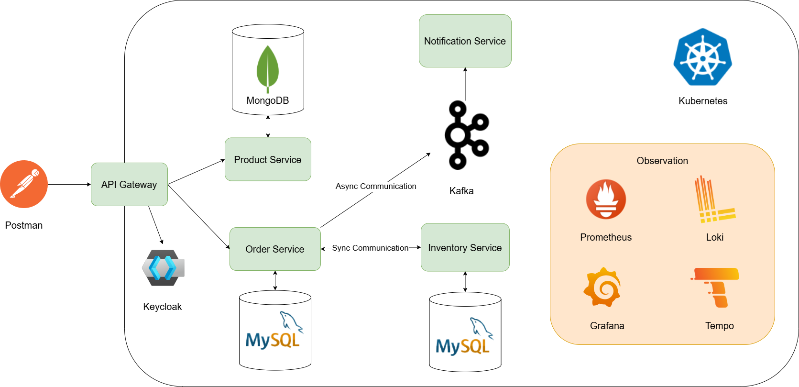

# Spring Boot Microservices with Kubernetes

A production-ready microservices application built with Spring Boot, deployed on Kubernetes, featuring distributed tracing, centralized logging, metrics monitoring, and event-driven communication.

---

## Architecture Overview



### Services

| Service | Port | Database | Description |
|---|---|---|---|
| **api-gateway** | 9000 | — | Spring Cloud Gateway — routes, circuit breaker, JWT auth |
| **product-service** | 8080 | MongoDB | CRUD for products |
| **order-service** | 8081 | MySQL | Places orders, checks inventory, publishes Kafka events |
| **inventory-service** | 8082 | MySQL | Stock availability checks |
| **notification-service** | 8083 | — | Kafka consumer — sends order confirmation emails |

### Infrastructure

| Component | Port | Purpose |
|---|---|---|
| Keycloak | 8080 | Identity & Access Management (OAuth2/JWT) |
| MySQL | 3306 | Order & Inventory databases |
| MongoDB | 27017 | Product database |
| Apache Kafka + Zookeeper | 9092 / 2181 | Async messaging |
| Kafka UI | 8080 | Kafka management UI |
| Prometheus | 9090 | Metrics scraping |
| Grafana | 3000 | Dashboards (Metrics + Logs + Traces) |
| Loki | 3100 | Log aggregation |
| Tempo | 3200 / 9411 | Distributed tracing |

---

## Prerequisites

- [Docker Desktop](https://www.docker.com/products/docker-desktop/) with Kubernetes enabled **or** [minikube](https://minikube.sigs.k8s.io/)
- `kubectl` CLI
- Java 21 + Maven (for local dev / building images)
- [Postman](https://www.postman.com/) (for API testing)

---

## Project Structure

```
k8s-microservices/
├── api-gateway/
├── product-service/
├── order-service/
├── inventory-service/
├── notification-service/
└── k8s/
    └── manifests/
        ├── infrastructure/       # Kafka, MySQL, MongoDB, Keycloak, Observability
        │   ├── kafka.yml
        │   ├── zookeeper.yml
        │   ├── kafka-ui.yml
        │   ├── mysql.yml
        │   ├── mongodb.yml
        │   ├── keycloak.yml
        │   ├── kafka-mysql.yml
        │   ├── prometheus.yml
        │   ├── grafana.yml
        │   ├── loki.yml
        │   └── tempo.yml
        └── applications/         # Microservices
            ├── common-config.yml
            ├── api-gateway.yml
            ├── product-service.yml
            ├── order-service.yml
            ├── inventory-service.yml
            └── notification-service.yml
```

---

## Setup & Deployment

### 1. Build & Push Docker Images

From the root of the project, build and publish all service images to Docker Hub. Replace `your-docker-username` or use the configured username `trungpham100`.

```bash
# Build and push all services (requires Docker login)
mvn spring-boot:build-image -DdockerPassword=<your_docker_password>
```

Or build each service individually:

```bash
cd product-service
mvn spring-boot:build-image -DdockerPassword=<your_docker_password>

cd ../order-service
mvn spring-boot:build-image -DdockerPassword=<your_docker_password>

# Repeat for inventory-service, notification-service, api-gateway
```

> **Note:** Images are tagged as `trungpham100/<service-name>:latest`. Update image names in the k8s manifests if using your own Docker Hub account.

### 2. Deploy Infrastructure

```bash
# Deploy databases
kubectl apply -f k8s/manifests/infrastructure/mysql.yml
kubectl apply -f k8s/manifests/infrastructure/mongodb.yml

# Deploy Keycloak (needs its own MySQL instance)
kubectl apply -f k8s/manifests/infrastructure/kafka-mysql.yml
kubectl apply -f k8s/manifests/infrastructure/keycloak.yml

# Deploy Kafka
kubectl apply -f k8s/manifests/infrastructure/zookeeper.yml
kubectl apply -f k8s/manifests/infrastructure/kafka.yml
kubectl apply -f k8s/manifests/infrastructure/kafka-ui.yml

# Deploy observability stack
kubectl apply -f k8s/manifests/infrastructure/loki.yml
kubectl apply -f k8s/manifests/infrastructure/tempo.yml
kubectl apply -f k8s/manifests/infrastructure/prometheus.yml
kubectl apply -f k8s/manifests/infrastructure/grafana.yml
```

Wait for all infrastructure pods to be ready:

```bash
kubectl get pods -w
```

### 3. Deploy Microservices

```bash
# Apply shared config first
kubectl apply -f k8s/manifests/applications/common-config.yml

# Deploy services
kubectl apply -f k8s/manifests/applications/product-service.yml
kubectl apply -f k8s/manifests/applications/inventory-service.yml
kubectl apply -f k8s/manifests/applications/order-service.yml
kubectl apply -f k8s/manifests/applications/notification-service.yml
kubectl apply -f k8s/manifests/applications/api-gateway.yml
```

### 4. Verify All Pods Are Running

```bash
kubectl get pods
```

Expected output (all pods in `Running` state):

```
NAME                                    READY   STATUS    RESTARTS
api-gateway-xxxx                        1/1     Running   0
product-service-xxxx                    1/1     Running   0
order-service-xxxx                      1/1     Running   0
inventory-service-xxxx                  1/1     Running   0
notification-service-xxxx               1/1     Running   0
keycloak-xxxx                           1/1     Running   0
mysql-xxxx                              1/1     Running   0
mongodb-xxxx                            1/1     Running   0
broker-xxxx                             1/1     Running   0
zookeeper-xxxx                          1/1     Running   0
prometheus-xxxx                         1/1     Running   0
grafana-xxxx                            1/1     Running   0
loki-xxxx                               1/1     Running   0
tempo-xxxx                              1/1     Running   0
```

---

## Accessing Services via Port-Forward

Since services are not exposed externally by default, use `kubectl port-forward` to reach them locally.

### API Gateway (main entry point)

```bash
kubectl port-forward svc/api-gateway 9000:9000
```

Access at: `http://localhost:9000`

### Individual Services

```bash
# Product Service
kubectl port-forward svc/product-service 8080:8080

# Order Service
kubectl port-forward svc/order-service 8081:8081

# Inventory Service
kubectl port-forward svc/inventory-service 8082:8082

# Notification Service
kubectl port-forward svc/notification-service 8083:8083
```

### Infrastructure UIs

```bash
# Keycloak Admin Console
kubectl port-forward svc/keycloak 8181:8080

# Kafka UI
kubectl port-forward svc/kafka-ui 8086:8080

# Grafana (Metrics/Logs/Traces)
kubectl port-forward svc/grafana 3000:3000

# Prometheus
kubectl port-forward svc/prometheus 9090:9090
```

> **Tip:** Run port-forward commands in separate terminal tabs, or use `&` to background them.

---

## Authentication with Keycloak

The API Gateway enforces JWT authentication on all routes (except Swagger and Actuator).

### 1. Get an Access Token

Forward Keycloak first:

```bash
kubectl port-forward svc/keycloak 8181:8080
```

Then request a token using the `client_credentials` flow:

```bash
curl -X POST http://localhost:8181/realms/spring-microservices-security-realm/protocol/openid-connect/token \
  -H "Content-Type: application/x-www-form-urlencoded" \
  -d "grant_type=client_credentials" \
  -d "client_id=spring-cloud-client-id" \
  -d "client_secret=<your-client-secret>"
```

Copy the `access_token` value from the response.

### 2. Use the Token in Requests

Add the token as a Bearer header in all API calls:

```
Authorization: Bearer <access_token>
```

---

## Testing APIs with Postman

### Setup: Port-Forward API Gateway

```bash
kubectl port-forward svc/api-gateway 9000:9000
```

All requests below use `http://localhost:9000` as the base URL.

---

### Product Service

#### Create a Product

```
POST http://localhost:9000/api/product
Authorization: Bearer <token>
Content-Type: application/json

{
  "name": "iPhone 15",
  "description": "Apple iPhone 15 128GB",
  "price": 999.99
}
```

Expected Response `201 Created`:
```json
{
  "id": "64abc123...",
  "name": "iPhone 15",
  "description": "Apple iPhone 15 128GB",
  "price": 999.99
}
```

#### Get All Products

```
GET http://localhost:9000/api/product
Authorization: Bearer <token>
```

Expected Response `200 OK`:
```json
[
  {
    "id": "64abc123...",
    "name": "iPhone 15",
    "description": "Apple iPhone 15 128GB",
    "price": 999.99
  }
]
```

---

### Inventory Service

#### Check Stock Availability

```
GET http://localhost:9000/api/inventory?skuCode=iphone_15&quantity=1
Authorization: Bearer <token>
```

Expected Response `200 OK`:
```
true
```

The inventory is pre-seeded with:
- `iphone_15` — 100 units
- `galaxy_24` — 100 units

---

### Order Service

#### Place an Order

```
POST http://localhost:9000/api/order
Authorization: Bearer <token>
Content-Type: application/json

{
  "skuCode": "iphone_15",
  "price": 999.99,
  "quantity": 2,
  "userDetails": {
    "email": "customer@example.com",
    "firstName": "John",
    "lastName": "Doe"
  }
}
```

Expected Response `201 Created`:
```
Order Placed
```

What happens behind the scenes:
1. Order Service calls Inventory Service to verify stock
2. If in stock, the order is saved to MySQL
3. An `OrderPlacedEvent` is published to the Kafka topic `order-placed`
4. Notification Service consumes the event and sends a confirmation email

#### Out-of-Stock Order (triggers circuit breaker fallback)

```
POST http://localhost:9000/api/order
Authorization: Bearer <token>
Content-Type: application/json

{
  "skuCode": "out_of_stock_item",
  "price": 499.00,
  "quantity": 1,
  "userDetails": {
    "email": "customer@example.com",
    "firstName": "Jane",
    "lastName": "Doe"
  }
}
```

Expected Response `500`:
```
Product out_of_stock_item is not in stock
```

---

### Swagger UI (No Auth Required)

After port-forwarding the API gateway:

```
http://localhost:9000/swagger-ui.html
```

The aggregated Swagger UI includes docs for all three services:
- Product Service → `/aggregate/product-service/v3/api-docs`
- Order Service → `/aggregate/order-service/v3/api-docs`
- Inventory Service → `/aggregate/inventory-service/v3/api-docs`

---

## Postman Environment Setup

Create a Postman Environment with these variables:

| Variable | Initial Value |
|---|---|
| `base_url` | `http://localhost:9000` |
| `keycloak_url` | `http://localhost:8181` |
| `access_token` | _(auto-filled by pre-request script)_ |

**Pre-request Script** (add to Collection level to auto-fetch tokens):

```javascript
pm.sendRequest({
    url: pm.environment.get("keycloak_url") + "/realms/spring-microservices-security-realm/protocol/openid-connect/token",
    method: "POST",
    header: { "Content-Type": "application/x-www-form-urlencoded" },
    body: {
        mode: "urlencoded",
        urlencoded: [
            { key: "grant_type", value: "client_credentials" },
            { key: "client_id", value: "spring-cloud-client-id" },
            { key: "client_secret", value: "<your-client-secret>" }
        ]
    }
}, (err, res) => {
    pm.environment.set("access_token", res.json().access_token);
});
```

Then use `{{access_token}}` in the Authorization header of every request.

---

## Observability

### Grafana Dashboards

```bash
kubectl port-forward svc/grafana 3000:3000
```

Open `http://localhost:3000` — login is disabled (anonymous admin access enabled).

Pre-configured datasources:
- **Prometheus** — application metrics (HTTP request rates, latency histograms, JVM stats)
- **Loki** — structured logs from all services
- **Tempo** — distributed traces (linked from logs via `traceId`)

### Kafka UI

```bash
kubectl port-forward svc/kafka-ui 8086:8080
```

Open `http://localhost:8086` to browse topics, consumer groups, and messages. The `order-placed` topic shows events whenever an order is placed.

### Actuator Health Endpoints

Each service exposes health and metrics via Spring Boot Actuator:

```bash
# Example: check order-service health
kubectl port-forward svc/order-service 8081:8081
curl http://localhost:8081/actuator/health

# Circuit breaker status
curl http://localhost:8081/actuator/health | jq '.components.circuitBreakers'

# Prometheus metrics
curl http://localhost:8081/actuator/prometheus
```

---

## Resilience Patterns

### Circuit Breaker (Resilience4j)

The Order Service uses a circuit breaker when calling the Inventory Service:

- **Sliding window:** 10 COUNT-based calls
- **Failure threshold:** 50% — opens circuit after 5/10 failures
- **Wait in open state:** 5 seconds before trying half-open
- **Fallback:** Returns `false` (order rejected) when circuit is open

### Retry

- **Max attempts:** 3
- **Wait between retries:** 2 seconds

### Timeout

- **Connect timeout:** 3 seconds
- **Read timeout:** 3 seconds

### API Gateway Circuit Breaker

Each upstream service route in the gateway has its own circuit breaker. On failure, the gateway returns:

```
503 Service Unavailable — "Service Unavailable, please try again later"
```

---

## Local Development

To run a service locally (outside Kubernetes), use the provided `docker-compose.yml` files in each service directory.

**Product Service:**
```bash
cd product-service
docker-compose up -d   # starts MongoDB
mvn spring-boot:run
```

**Order Service:**
```bash
cd order-service
docker-compose up -d   # starts MySQL + Kafka
mvn spring-boot:run
```

**Inventory Service:**
```bash
cd inventory-service
docker-compose up -d   # starts MySQL
mvn spring-boot:run
```

---

## Cleanup

Remove all deployed resources:

```bash
# Remove applications
kubectl delete -f k8s/manifests/applications/

# Remove infrastructure
kubectl delete -f k8s/manifests/infrastructure/
```

---

## Tech Stack

| Layer | Technology |
|---|---|
| Language | Java 21 |
| Framework | Spring Boot 3.5, Spring Cloud 2025.0.2 |
| API Gateway | Spring Cloud Gateway (MVC) |
| Auth | Keycloak 24 + Spring Security OAuth2 Resource Server |
| Messaging | Apache Kafka (Confluent 7.5) |
| Databases | MySQL 8, MongoDB 7 |
| Resilience | Resilience4j (Circuit Breaker, Retry, Timeout) |
| Tracing | Micrometer Brave + Zipkin → Grafana Tempo |
| Metrics | Micrometer + Prometheus + Grafana |
| Logging | Logback + Loki4j → Grafana Loki |
| API Docs | SpringDoc OpenAPI 2.8.5 |
| Container | Docker + Kubernetes |
| DB Migration | Flyway |